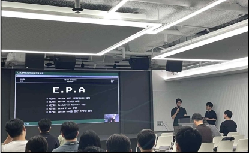
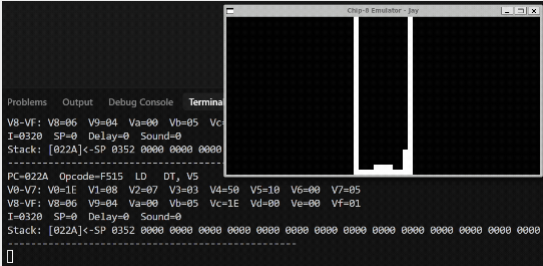
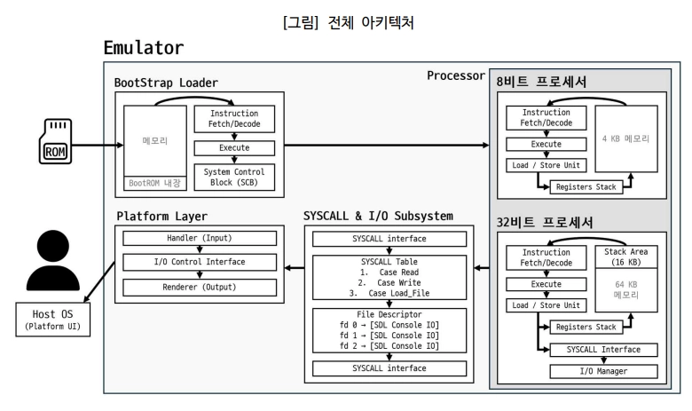
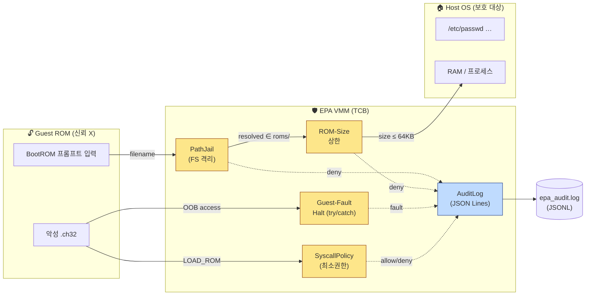
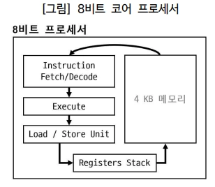
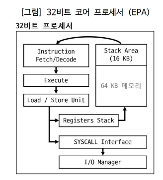
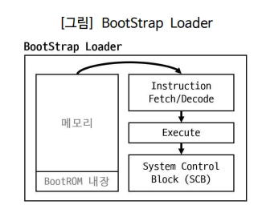
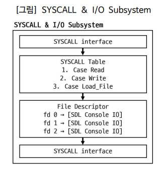

# EmulParty Advance — VMM-Hardened CHIP-8 Extended Emulator

> *교육용 32-bit 가상머신을, 신뢰할 수 없는 게스트 ROM이 호스트를 침해하지 못하도록 격리 런타임으로 하드닝했다.*

```
╔══════════════════════════════════════════════════════════════════════╗
║              EmulParty Advance (EPA) — CHIP-8 Extended v2.0          ║
║                  Educational VM  ⨯  Hardened VMM                     ║
╠══════════════════════════════════════════════════════════════════════╣
║  Dual-Mode CPU      :  8-bit Chip-8  +  32-bit EPA (R0–R31, 64KB)    ║
║  Boot Pipeline      :  BootROM → Mode Selector → ROM Load            ║
║  Modern Constructs  :  x86-style Stack Frame · SYSCALL · Debugger    ║
║  Security Hardening :  PathJail · ROM-Size · Guest-Fault · Policy    ║
║                        · Audit-Log (JSON Lines)                      ║
║                        ─ 4 escape vectors blocked, 23 regression OK  ║
╚══════════════════════════════════════════════════════════════════════╝
```

<p align="center">
  
  
  
  
  
  
  
</p>

<p align="center">
  
  <br>
  <sub><i>EPA — OWASP Seoul Chapter 2025년 7월 세미나 (주니어 세션) 발표 현장</i></sub>
</p>

---

## ⚡ 30초 요약 (TL;DR)

**EPA는 두 얼굴을 가졌다.** 안쪽으로는 WHS 3기 에뮤르파티 팀이 만든 *교육용 32-bit 경량 가상머신* — Chip-8을 64KB 메모리·32개 32-bit R-레지스터·x86식 스택 프레임으로 확장한 ISA 학습 플랫폼이다. 바깥쪽으로는 *격리 런타임(VMM)* — `.ch32` ROM이 신뢰할 수 없는 게스트라는 관점에서 다시 보면, EPA 코어는 그 게스트와 호스트 사이를 가르는 **TCB(신뢰 컴퓨팅 기반)** 다.

`dev` 브랜치는 이 두 번째 정체성에 집중한다. **VM 탈출(VM Escape)** 의 4가지 벡터 — 파일시스템 탈출 · DoS · 권한 초과 · 감사 부재 — 를 식별하고, 각각에 대응하는 가드를 신설했다.

| 영역 | 결과 |
|---|---|
| 🧱 차단한 탈출 벡터 | **4종** (CWE-22 · CWE-400/248 · CWE-269 · CWE-778) |
| 🛡 신규 보안 모듈 | `PathJail` · `SyscallPolicy` · `AuditLog` + ROM-Size 상한 + Guest-Fault Halt |
| ✅ 회귀 테스트 | Catch2 **13 케이스 / 23 assertions 모두 통과** |
| 📜 감사 추적 | JSON Lines `epa_audit.log` — SIEM 적재 가능 포맷 |
| 🎯 매핑 | Firecracker `jailer` · runc FS 격리 · gVisor seccomp · 컨테이너 capability drop |

> **한 줄로**: "교육용 에뮬레이터를 컨테이너/VM 보안의 축소판 실습장으로 다시 빚었다."

---

## 🎮 실제 동작 모습

### 32-bit 코어에서 게임 실행 (디버그 콘솔 동시 출력)

<p align="center">
  
</p>

> 우측 SDL2 창에서 게임이 실시간 렌더링되는 동안, 좌측 콘솔이 매 프레임의
> 레지스터(`V0–VF` / `R0–R31`), 스택 포인터(`SP`), 명령어 카운터(`PC`), 현재 opcode를
> 그대로 토해낸다. 디버거에서 `sf`를 치면 32-bit 모드의 스택 프레임이 ASCII 다이어그램으로
> 시각화된다 — *"눈으로 보는 Calling Convention"* 이 이 프로젝트의 교육적 핵심이다.

---

## 🏗 시스템 설계 구조 — 한 장의 아키텍처

<p align="center">
  
  <br>
  <sub><i>[그림] 전체 아키텍처 — BootStrap Loader · Processor (8-bit / 32-bit) · SYSCALL & I/O · Platform Layer 4-계층 구조</i></sub>
</p>

이 한 장에 EPA의 거의 모든 게 있다:

- 🔌 **ROM → BootStrap Loader** : 사용자가 준 `.ch8`/`.ch32`가 들어오는 유일한 입구.
  *VMM 관점에서 보면 여기가 게스트와 호스트가 만나는 첫 경계다.*
- 🧠 **Processor (8-bit / 32-bit)** : Fetch → Decode → Execute 사이클. 두 코어가 *동일 실행 파일 안에 공존* 한다.
- 🔁 **SYSCALL & I/O Subsystem** : `SYSCALL` 명령 → `vector_swi` 디스패치 → File Descriptor → 실제 I/O.
  실제 Linux 시스템콜 구조를 그대로 미니어처로 만든 부분.
- 🖥 **Platform Layer** : SDL2 입출력. 코어와 호스트 OS의 *유일한* 경계로 강제.

> 이 아키텍처가 **"왜 EPA를 VMM으로 다시 볼 수 있나"** 의 답이다 — 각 계층이 이미 책임 경계를 갖고 있어,
> 보안 가드를 *얹기만* 하면 되는 모듈 구조다.

---

## 🔥 Live Demo — 4가지 VM 탈출을 어떻게 막았나

> 이 섹션은 **"감사 로그(audit log)에 적힌 한 줄 한 줄이 무슨 의미인지" 처음 보는 사람도 따라올 수 있도록**
> 풀어 쓴 시연 기록이다. 모든 raw 로그는 [`docs/demo-evidence/`](docs/demo-evidence/) 에 보존돼 있다.

### Audit Log를 읽는 법 (60초)

EPA는 보안 결정을 내릴 때마다 한 줄짜리 JSON을 `stderr`와 `epa_audit.log`에 동시 출력한다. SIEM(Splunk·Elastic·Datadog)에 그대로 적재할 수 있는 표준 포맷이다.

```json
{"ts":"2026-05-23T08:46:33Z","event":"path_jail","decision":"deny",
 "input":"../../etc/passwd","reason":"forbidden_character",
 "detail":"filename contains path separator or NUL",
 "caller":"load_and_switch_mode"}
```

| 필드 | 뜻 |
|---|---|
| `ts`        | ISO-8601 UTC 타임스탬프 — 사건 순서·포렌식의 기준 |
| `event`     | 어느 가드가 결정했는지 (`path_jail`·`syscall_policy`·`rom_size`·`rom_load`·`vmm_start`) |
| `decision`  | `allow` / `deny` — 그 가드가 통과시켰는지, 차단했는지 |
| `input`     | 게스트가 준 *원본* 입력 (정규화 전) |
| `reason`    | 머신 친화적 짧은 사유 코드 (`forbidden_character`·`escapes_root`·`exceeds_max_rom_bytes` …) |
| `detail`    | 사람이 읽기 위한 상세 메시지 |
| `caller`    | 어느 코드 경로에서 호출됐는지 (디버깅·역추적용) |

**왜 이렇게 만들었나** — 보안 결정이 `std::cout`에 흩어져 있으면 SOC가 침해 시도를 *영원히 못 본다*. CWE-778(불충분한 로깅) 자체가 별도의 보안 결함이다. 그래서 모든 결정 지점을 한 곳에 모았다.

---

### [BASELINE] 정상 ROM 흐름 — 통과해야 할 발자국들

게스트가 `pong.ch32`를 요청했을 때 *어떤 가드들이 차례로 통과시키는지* 를 먼저 보자. 차단 시연을 이해하려면 정상 흐름을 먼저 알아야 한다.

```text
=== [1/5] BASELINE: normal pong.ch32 ===
{"event":"vmm_start","jail_root":".../roms","max_rom_bytes":"65536"}                      # ①
{"event":"syscall_policy","decision":"allow","profile":"bootrom","syscall":"WRITE"}       # ②
{"event":"syscall_policy","decision":"allow","profile":"bootrom","syscall":"READ"}        # ③
{"event":"syscall_policy","decision":"allow","profile":"bootrom","syscall":"LOAD_ROM"}    # ④
{"event":"path_jail","decision":"allow","input":"pong.ch32",
 "resolved":".../roms/pong.ch32"}                                                         # ⑤
{"event":"rom_load","decision":"allow","resolved":".../roms/pong.ch32",
 "size":"496","ext":".ch32"}                                                              # ⑥
```

> ① **VMM 부팅** — jail 루트(`roms/`)와 ROM 크기 상한(64KB)을 못박는다. *"여기서부터 여기까지가 게스트 영역"* 임을 모든 후속 결정의 기준선으로 선언한다.
> ② BootROM이 "ROM 이름 입력하세요" 메시지를 화면에 쓴다. BootROM 프로파일이라 `WRITE` 허용.
> ③ 사용자 입력을 받는다(`READ`). BootROM이라 허용.
> ④ BootROM이 입력받은 이름으로 `LOAD_ROM` 호출. **이건 BootROM만 부를 수 있는 권한 syscall이다** — 일반 게스트가 호출하면 V3 정책에서 막힌다.
> ⑤ `PathJail`이 파일명을 검증 — `pong.ch32`는 디렉터리 구분자가 없고, jail 루트 안으로 정규화되니 통과.
> ⑥ ROM 크기 가드 — 496 bytes ≪ 64KB이므로 통과. 이제부터 32-bit 코어가 게스트 ROM을 실행한다.

**핵심 통찰**: 정상 케이스에서도 *결정의 발자국이 빠짐없이 남는다*. 이게 감사(audit)의 본질이다.

---

### [V1a] 경로 탐색 (Path Traversal) — `../../etc/passwd`

**시도하는 공격**: BootROM 프롬프트에 `../../etc/passwd`를 입력해서 `roms/`를 벗어나 호스트의 `/etc/passwd`를 읽으려 한다. 옛날 PHP 웹쉘에서 수없이 봐온 그 공격이다.

**원래 코드의 문제**:
```cpp
// BEFORE  ⚠ 검증 없음
return std::filesystem::path("roms") / filename;
// "roms" / "../../etc/passwd"  ⇒  "roms/../../etc/passwd"
// → 실제로 호스트 파일이 열린다. CWE-22.
```

**차단된 결과**:
```json
{"event":"path_jail","decision":"deny",
 "input":"../../etc/passwd","reason":"forbidden_character",
 "detail":"filename contains path separator or NUL",
 "caller":"load_and_switch_mode"}
```

**해설**: `PathJail::resolve`가 1차 방어선에서 *파일명 자체에 `/`·`\`·NUL이 있는지* 먼저 본다. 게스트는 정상적인 ROM 파일명이라면 디렉터리 구분자를 줄 이유가 없다. 그래서 이 단계에서 즉시 `forbidden_character`로 거부 — 정규화 단계까지 갈 필요도 없다. 빠르고 단순한 *fail-fast* 룰.

---

### [V1b] 절대 경로 — `/etc/passwd`

**왜 따로 막아야 하나** — C++ `std::filesystem`의 잘 알려진 함정 때문이다.

```cpp
std::filesystem::path("roms") / "/etc/passwd";
// 결과: "/etc/passwd"   ← "roms"가 사일런트하게 무시됨!
```

`/` 연산자는 오른쪽이 절대경로면 왼쪽을 그냥 버린다. 이걸 모르고 짠 코드는 jail이 무력화된다. **이건 진짜로 Firecracker·Docker에서도 과거에 발생했던 클래스의 버그다.**

```json
{"event":"path_jail","decision":"deny",
 "input":"/etc/passwd","reason":"forbidden_character",
 "detail":"filename contains path separator or NUL",
 "caller":"load_and_switch_mode"}
```

**해설**: V1a와 같은 룰(`/` 포함 거부)이 이 케이스도 같이 잡는다. *"두 마리 토끼를 한 룰로"* — 가드의 단순성이 곧 견고함이다.

---

### [V1c] 심볼릭 링크 탈출 — `roms/sneaky.ch32 → /etc/passwd`

**시도하는 공격**: 공격자가 `roms/` 안에 `sneaky.ch32`라는 *심볼릭 링크* 를 두고, 그게 `/etc/passwd`를 가리키게 만든다. 이름만 보면 jail 안이지만 **OS가 따라가는 진짜 경로는 호스트 파일이다.**

**왜 V1a/V1b 룰로는 못 막나** — 파일명 자체("`sneaky.ch32`")에 `/`도 절대경로도 없다. 1차 룰을 통과한다.

**2차 방어선이 잡는다**:
```json
{"event":"path_jail","decision":"deny",
 "input":"sneaky.ch32","reason":"escapes_root",
 "detail":"resolved path escapes jail: /etc/passwd (root=.../roms)",
 "caller":"load_and_switch_mode"}
```

**해설**: `PathJail`이 `weakly_canonical()`로 경로를 정규화한다 — **심볼릭 링크를 따라간 후의 진짜 경로** 가 나온다. 그 다음 `lexically_relative(root)`로 jail 루트의 하위인지 검사. 결과가 `..`로 시작하면 `escapes_root`로 거부. *"이름이 아니라 실체로 판단한다"* — 컨테이너 보안의 기본 원리이며 Firecracker `jailer`·Docker `pivot_root`가 같은 방식으로 푼다.

---

### [V2] DoS — 100KB 거대 ROM으로 호스트 메모리 고갈

**시도하는 공격**: 100KB짜리 빈 `.ch32` 파일을 만들어 로드. 원래 코드는 `g_rom_data.resize(size)`로 *파일 크기 그대로* 메모리에 잡았다. 공격자가 10GB 파일을 주면 호스트 RAM이 고갈된다 (CWE-400).

```json
{"event":"path_jail","decision":"allow","input":"huge.ch32",
 "resolved":".../roms/huge.ch32"}                                       # ← PathJail은 통과
{"event":"rom_size","decision":"deny",
 "resolved":".../roms/huge.ch32",
 "size":"102400","limit":"65536","reason":"exceeds_max_rom_bytes"}      # ← 여기서 컷
```

**해설**: PathJail은 *"경로가 jail 안이냐"* 만 본다 — `huge.ch32`는 정당한 jail 내부 파일이라 통과시킨다. 그 다음 ROM-Size 가드가 *"용량이 게스트 메모리 한도(64KB) 안이냐"* 를 본다. 102,400 > 65,536 이므로 `exceeds_max_rom_bytes`로 거부. **가드가 단일 함수가 아니라 *체인* 으로 동작한다** — 각각이 자기 책임만 정확히 진다.

**자매 가드: Guest-Fault Halt** — 게스트 opcode가 OOB 메모리 주소(`memory.at(0xFFFFF)`)를 건드리면 원래는 `std::out_of_range`가 핸들되지 않아 VMM 전체가 죽었다(CWE-248). `Chip8_32::cycle()`을 `try/catch`로 감싸 *해당 게스트만 `halt(reason)` 플래그를 세우고, VMM 본체는 살아남게* 했다. 이것이 하이퍼바이저의 **fault isolation** 원리다.

---

### [V3] 최소권한 부재 — 게스트의 `LOAD_ROM` 무한 호출

**시도하는 공격**: 악성 ROM이 `SYSCALL 3` (LOAD_ROM)을 무한 반복 호출 — 임의 파일 마운트, 다른 ROM 끼워넣기, V1·V2 공격을 연쇄 시도.

**원래 코드의 문제**: `OP_10SAAAAF`의 `switch` 문이 syscall 번호만 보고 *누가 부르든* 그대로 실행했다. 권한·정책 개념이 없었다(CWE-269).

**`SyscallPolicy` 가 PC 값으로 호출자를 자동 분류한다**:
```cpp
profile = (PC < 0x0200) ? kBootRom : kGuest;
// BootROM 영역(0x0000~0x01FF)에서 부른 호출 = 신뢰 코드
// 사용자 ROM 영역(0x0200~)에서 부른 호출 = 신뢰 X
```

**프로파일별 허용 목록**:

| Syscall            | BootROM | Guest | 비고 |
|---|---|---|---|
| `READ`     (0)     | ✅ | ✅ | 콘솔 입력 |
| `WRITE`    (1)     | ✅ | ✅ | 콘솔 출력 |
| `GETPID`   (2)     | ✅ | ✅ | 정보성 |
| `LOAD_ROM` (3)     | ✅ | ❌ | **호스트 상태 변경 — BootROM만** |
| `EXIT`     (4)     | ✅ | ✅ | 자기 종료는 자유 |
| `CALC`     (5)     | ✅ | ✅ | 순수 연산 |
| `DEBUG`, 미정의    | ✅ | ❌ | 게스트 차단 |

```json
{"event":"syscall_policy","decision":"deny","profile":"guest",
 "syscall":"LOAD_ROM","num":"3","reason":"not_in_allowlist"}
```

**해설**: 게스트가 LOAD_ROM을 호출하려고 하면 차단 + `R16 = 0xFFFFFFFF` (errno 스타일) + 감사 기록 + PC만 진행. **게스트가 V1을 *재시도조차 시작 못 하게* 막는 게 핵심.** 컨테이너 `seccomp` 프로파일, Linux capability drop, 제로트러스트 최소권한과 직접 매핑되는 모델이다.

> 회귀 안전성: **BootROM 자신** 이 부르는 LOAD_ROM은 BootROM 프로파일이라 정상 통과. 기존 부팅 흐름은 한 줄도 안 깨진다 (`docs/demo-evidence/baseline.txt:5`).

---

### [V4] 감사 부재 — "막았다는 사실"을 증명하는 능력

여기까지 읽었으면 눈치챘을 거다. **V4는 별도의 벡터가 아니라 V1~V3을 *증명* 하는 메타-가드다.**

- ❌ 차단했는데 기록이 없으면? SOC는 침해 시도를 *영원히 못 본다*. 사후 포렌식도 불가능.
- ❌ `std::cout`으로만 흘려보내면? grep으로 줍는 SRE에게 빌어야 한다.

**`AuditLog` 가 한다**:
- JSON Lines (1 event = 1 line) — Splunk·Elastic이 즉시 파싱.
- `stderr` + `epa_audit.log` 동시 출력 — 컨테이너 stdout 수집 파이프라인과 친화적.
- `mutex` 가드 — 멀티스레드 확장 대비.

위에서 본 모든 JSON 라인이 V4의 산출물이다. **즉, 처음 보는 사람이 *"얘네가 뭐 했구나"* 를 알 수 있는 이유 자체가 V4다.**

---

### 🧪 직접 재현하기

```bash
# 빌드
cd build && cmake .. && make -j$(nproc)

# 정상 케이스 (베이스라인)
./chip8_dual --headless --rom pong.ch32 --max-frames 60

# 4가지 공격 시연
./chip8_dual --headless --rom ../../etc/passwd --max-frames 60   # V1a
./chip8_dual --headless --rom /etc/passwd      --max-frames 60   # V1b
ln -sf /etc/passwd ../roms/sneaky.ch32 \
  && ./chip8_dual --headless --rom sneaky.ch32 --max-frames 60   # V1c
dd if=/dev/zero of=../roms/huge.ch32 bs=1024 count=100 \
  && ./chip8_dual --headless --rom huge.ch32  --max-frames 60    # V2

# 결과는 epa_audit.log에 JSON Lines로 누적
tail -f build/epa_audit.log

# 회귀 테스트 (Catch2 13 cases / 23 assertions)
./test_hardening
# → All tests passed (23 assertions in 13 test cases)
```

기대 결과: **모든 공격 입력에서 `path_jail` 또는 `rom_size` deny 이벤트가 기록되며, 호스트 파일은 단 한 바이트도 노출되지 않는다.**

---

## 🧭 Why → How → Impact

### 1️⃣ Why — 왜 교육용 에뮬레이터를 보안 하드닝했나

원본 EPA(에뮤르파티 팀, WHS 3기 산출물)는 학습자가 *시스템 보안 취약점을 안전한 가상 환경에서 실습* 하기 위해 만들어졌다. 즉 게스트 ROM 안에서 일어나는 스택 버퍼 오버플로우·ROP 같은 *guest-internal* 보안을 다룬다.

그런데 PDF 보고서를 닫고 코드를 다시 보면, EPA 자체가 또 다른 보안 문제를 안고 있다:

> **EPA의 코어 코드는 *VMM(가상 머신 모니터)* 이다.**
> 게스트 ROM은 신뢰할 수 없는 입력이고, 호스트 OS는 보호 대상이다.
> 그 사이 경계를 지키는 것이 VMM의 1차 책임 — 그게 *VM 탈출 방지* 다.

이 관점에서 보면 PDF 3.3절의 후속 과제("보안 시나리오 확장")는 *guest-internal*만이 아니라 *VMM-host* 경계까지 포함해야 한다. **이 `dev` 브랜치가 그 후속 과제의 한 갈래다.**

### 2️⃣ How — 4-Vector × 5-Guard 매트릭스



| 가드 \ 벡터        | V1 FS 탈출       | V2 DoS  | V3 권한 | V4 감사 |
|---|---|---|---|---|
| **PathJail**          | ✅ 차단          | —       | 간접 (LOAD_ROM 봉쇄) | 결정 기록 |
| **ROM 크기 상한**     | —                | ✅ (a)  | —       | 결정 기록 |
| **Guest-Fault Halt**  | —                | ✅ (b)  | —       | 폴트 기록 |
| **SyscallPolicy**     | 간접             | —       | ✅      | 결정 기록 |
| **AuditLog**          | —                | —       | —       | ✅ |

### 3️⃣ Impact — Before / After

| 항목                                       | Before (원본 EPA) | After (`dev` 브랜치) |
|---|---|---|
| 호스트 파일 노출 (`../../etc/passwd`)      | 🔴 가능 | ✅ `path_jail deny` |
| 거대 ROM으로 호스트 RAM 고갈               | 🔴 가능 | ✅ `rom_size deny` |
| 잘못된 게스트 ROM이 VMM 죽임               | 🔴 가능 | ✅ Guest-only halt, VMM 유지 |
| 게스트의 `LOAD_ROM` 임의 호출              | 🔴 가능 | ✅ `syscall_policy deny` |
| 침해 시도 감사 추적                         | ❌ 없음 | ✅ `epa_audit.log` (JSONL) |
| 회귀 안전성                                 | —       | ✅ 23/23 assertions, 정상 ROM 무영향 |

---

## 🏛 신뢰 경계 — EPA를 VMM으로 다시 보기

```
┌───────────────────────────────────────────────────────────────┐
│  Host OS  (Linux / macOS / WSL2)   ← 보호 대상                │
│  ┌─────────────────────────────────────────────────────────┐  │
│  │  EPA VMM (C++17 / SDL2)   ← TCB : 신뢰 컴퓨팅 기반       │  │
│  │  - chip8 / chip8_32 · opcode tables · BootROM           │  │
│  │  - PathJail · SyscallPolicy · AuditLog  ← 본 하드닝     │  │
│  │  ┌───────────────────────────────────────────────────┐  │  │
│  │  │  Guest ROM (.ch8 / .ch32)   ← 신뢰 X (공격자)      │  │  │
│  │  │  64KB 메모리 · 32 × 32bit 레지스터 · SYSCALL 만 통신 │  │  │
│  │  └───────────────────────────────────────────────────┘  │  │
│  └─────────────────────────────────────────────────────────┘  │
└───────────────────────────────────────────────────────────────┘

Trust Boundary
  ① Guest ROM  ┃ EPA VMM   : SYSCALL · 메모리 접근
  ② EPA VMM    ┃ Host OS   : 파일시스템 · 프로세스 자원
```

자세한 위협 모델은 [`docs/threat-model.md`](docs/threat-model.md), 4벡터 시연 로그는 [`docs/demo-evidence/`](docs/demo-evidence/) 참조.

---

## 🧩 원본 EPA 정체성 — 듀얼 모드 32-bit 가상머신

> 보안 하드닝만 봤다면 EPA가 *원래는 무엇이었는지* 도 짚자.
> *(원본 산출물: WHS 3기 에뮤르파티 팀 · OWASP Seoul Chapter 2025년 7월 세미나 발표 · GitBook 문서 공개)*

### 듀얼 프로세서 — 한 실행 파일, 두 코어

EPA는 8-bit Chip-8 코어와 32-bit EPA 코어를 *동일 실행 파일 안에 공존* 시킨다. BootStrap Loader가 ROM 확장자(`.ch8`/`.ch32`)로 자동 판별해 해당 코어를 활성화한다.

<table>
<tr>
<td align="center" width="50%"><b>8-bit 코어 (Chip-8 호환)</b></td>
<td align="center" width="50%"><b>32-bit 코어 (EmulParty Advance)</b></td>
</tr>
<tr>
<td align="center"></td>
<td align="center"></td>
</tr>
<tr>
<td>
<ul>
  <li>4 KB 메모리</li>
  <li>16 × 8-bit 레지스터 (V0–VF)</li>
  <li>2-byte 명령어 · 35종</li>
  <li>16단계 호출 스택</li>
  <li>원본 Joseph Weisbecker 1977 사양</li>
</ul>
</td>
<td>
<ul>
  <li><b>64 KB 메모리</b></li>
  <li><b>32 × 32-bit 레지스터 (R0–R31)</b> — R28=RBP · R29=RSP · R30=RIP</li>
  <li><b>4-byte 명령어 · 약 70종</b></li>
  <li><b>32 KB 동적 스택 프레임 (x86식)</b></li>
  <li>SYSCALL Interface + I/O Manager 내장</li>
</ul>
</td>
</tr>
</table>

### BootStrap Loader — 모드 자동 판별의 핵심

<p align="center">
  
</p>

부팅 시 SCB(System Control Block)가 먼저 32-bit 코어로 BootROM을 로드한다. BootROM은 사용자에게 ROM 이름을 받고, 확장자를 보고 SCB에 적절한 코어 전환을 요청한다.

**보안적 의미** — BootROM이 *유일한 권한 코드* 다. `LOAD_ROM` syscall은 BootROM 프로파일(`PC < 0x0200`)에서만 호출 가능하고, 일반 게스트는 차단된다. 즉 **BootStrap Loader 흐름 자체가 SyscallPolicy의 근거가 된다.**

### SYSCALL & I/O Subsystem — Linux 시스템콜의 미니어처

<p align="center">
  
</p>

32-bit 모드의 `SYSCALL imm16` 명령은 다음 흐름을 탄다:

```
SYSCALL Interface  →  SYSCALL Table  →  File Descriptor (fd 0/1/2)  →  Platform Layer
   (진입점)            (디스패치)         (장치 라우팅)              (실 I/O)
```

`fd 0` (stdin), `fd 1` (stdout), `fd 2` (stderr)이 SDL Console IO로 매핑된다 — Linux와 정확히 같은 구조. 이게 *"왜 EPA가 진짜 OS 시스템콜처럼 동작하는지"* 의 이유다.

### 32-bit ISA — 무엇이 추가됐나

| 그룹             | 명령어 |
|---|---|
| **스택 프레임**  | `PUSH Rx`, `POP Rx`, `SUB RSP imm16`, `ADD RSP imm16`, `CALL_FUNC addr`, `RET_FUNC` |
| **메모리 접근**  | `MOV [RBP+offset], Rx`, `MOV Rx, [RBP-offset]` |
| **시스템 콜**    | `SYSCALL imm16` — READ / WRITE / GETPID / LOAD_ROM / EXIT / CALC |

### 메모리 레이아웃 (32-bit 모드)

```
0x0000 ─────────────────────────  ← BootROM 영역 (Syscall PROFILE_BOOTROM)
0x01FF ─────────────────────────
0x0200 ─────────────────────────  ← 사용자 ROM (Guest 시작점, PROFILE_GUEST)
       │  Program (Compat: Chip-8 ROM도 0x0200부터)
0x0FFF │
0x1000 ─────────────────────────
       │  Extended Program Area (32-bit 전용)
0x7FFF │
0x8000 ─────────────────────────  ← Stack End
       │
       │      Stack Frame (32 KB)
       │      ─ RBP / RSP 동적 관리
       │
0xEFFF ─────────────────────────  ← Stack Start (top, downward growth)
0xF000 ─────────────────────────
       │  I/O · System Registers
0xFFFF ─────────────────────────
```

### x86식 스택 프레임 — 디버거 `sf` 명령으로 본 모습

```
=== Stack Frame Visualization ===
RBP (R28): 0x0000EFF0    RSP (R29): 0x0000EFE8
Usage: 8 / 32752 bytes (0.02%)

0xEFFF ┌─────────────────┐ Stack Start
       │                 │
0xEFF0 ├─────────────────┤ ← RBP (Frame Base)
       │   0x00000200    │   Return Address
0xEFEC ├─────────────────┤
       │   0x00000000    │   Local Variable
0xEFE8 ├─────────────────┤ ← RSP (Stack Top)
       │       FREE      │
0x8000 └─────────────────┘ Stack End
```

이 시각화 덕분에 학습자는 *함수 호출 규약 · 지역 변수 · 반환 주소* 같은 추상 개념을 *실제로 보면서* 익힐 수 있다 — 원본 프로젝트의 교육적 의도다. `sum_BOF.ch32` 같은 스택 BOF 실습 ROM은 이 시각화를 보면서 *RIP이 덮어쓰이는 순간* 을 직접 관찰할 수 있게 설계됐다.

---

## 🛠 Installation & Build

### 의존성

```bash
# Ubuntu / Debian / WSL2
sudo apt install libsdl2-dev libsdl2-ttf-dev cmake build-essential

# macOS
brew install sdl2 sdl2_ttf cmake

# Arch Linux
sudo pacman -S sdl2 sdl2_ttf cmake base-devel
```

### 빌드

```bash
git clone <your-fork-url>
cd EmulParty-Advance
mkdir -p build && cd build
cmake ..
make -j$(nproc)
# 산출물: ./chip8_dual           (메인 에뮬레이터)
#         ./test_hardening       (Catch2 회귀 테스트)
```

### 실행

```bash
# 일반 실행 (BootROM이 ROM 자동 감지)
./chip8_dual

# 헤드리스 (CI·서버·시연용)
./chip8_dual --headless --rom pong.ch32 --max-frames 600

# 디버거 켜기 (step / sf / reg / break …)
./chip8_dual --debug
```

### 디버거 명령어 (interactive)

| 명령              | 동작 |
|---|---|
| `s` / `step`         | 1 명령어 실행 |
| `c` / `continue`     | 브레이크포인트까지 진행 |
| `sf`                 | **스택 프레임 시각화** (32-bit 모드 전용) |
| `reg`                | 모든 레지스터 덤프 |
| `mem <addr>`         | 메모리 hex dump |
| `break <addr>`       | 브레이크포인트 설정 |
| `q` / `quit`         | 디버거 종료 |

---

## ✅ 테스트

```bash
cd build && cmake --build . --target test_hardening
./test_hardening
# ┌────────────────────────────────────────────────────────────────────┐
# │ All tests passed (23 assertions in 13 test cases)                  │
# └────────────────────────────────────────────────────────────────────┘
```

**커버리지** (`test/test_hardening.cpp` · 151 lines):
- **PathJail**     : 정상 파일명 / 빈 입력 / `/`·`\`·NUL 포함 / 절대경로 / `..`/ 심볼릭 링크 탈출 / 디렉터리 입력
- **ROM Size**     : 한도 경계값(64KB-1, 64KB, 64KB+1) · 0 바이트
- **SyscallPolicy**: PC < 0x0200 vs ≥ 0x0200 분류 · 7가지 syscall × 2 프로파일
- **AuditLog**     : JSON 이스케이프 · stderr 출력 · 파일 append

---

## 📁 프로젝트 구조

```
EmulParty-Advance/
├── CMakeLists.txt                  # 메인 + test_hardening 타깃
├── README.md                       # ← 이 문서
├── PROGRESS.md                     # VMM 하드닝 작업 일지
├── LICENSE                         # Apache 2.0
│
├── docs/                           # 보안 산출물 + 다이어그램
│   ├── threat-model.md             # 정식 위협 모델 (CWE·MITRE 매핑)
│   ├── demo-evidence/              # before/after raw 로그
│   │   ├── baseline.txt            # 정상 pong.ch32 흐름
│   │   ├── run_log.txt             # 4벡터 차단 시연 (V1a~V2)
│   │   └── epa_audit.jsonl         # JSONL 감사 로그
│   └── img/                        # 아키텍처 다이어그램 (PDF 출처)
│       ├── arch-overview.png · arch-bootstrap.png
│       ├── arch-cpu-chip8.png · arch-cpu-epa.png
│       ├── arch-syscall.png · owasp-seoul.png
│
├── include/
│   ├── boot/        boot_rom.hpp · boot_rom_data.hpp
│   ├── common/      constants.hpp
│   ├── core/        chip8.hpp · chip8_32.hpp · mode_selector.hpp
│   │                opcode_table*.hpp · stack_frame.hpp · stack_opcodes.hpp
│   ├── debugger/    debugger.hpp
│   ├── platform/    platform.hpp · timer.hpp
│   ├── security/    path_jail.hpp · audit_log.hpp           # ★ 신규
│   └── syscall/     io_device.hpp · io_manager.hpp · sdl_console_io.hpp
│                    syscall_policy.hpp                       # ★ 신규
│
├── src/                            # 동일 구조의 구현
│   ├── security/    path_jail.cpp · audit_log.cpp           # ★ 신규
│   └── syscall/     syscall_policy.cpp                       # ★ 신규
│
├── roms/                           # 게스트 ROM 컬렉션 (= jail 루트)
│   ├── pong.ch8 / pong.ch32        # 듀얼 모드 비교 학습용
│   ├── maze.ch8 / maze.ch32
│   ├── Brick.ch8                   # 클래식 Breakout
│   ├── calc*.ch32                  # 32-bit SYSCALL 흐름 예제
│   ├── sum_BOF.ch32                # 스택 BOF 실습용 (★ 원본 보안 시나리오)
│   └── image.png · syscall_image.png  # 실행 스크린샷
│
├── manual/                         # GitBook 동기화 문서 (원본 EPA 팀)
│   ├── installation.md · instruction-reference.md
│   ├── stack-frame.md · syscall.md
│
└── test/
    ├── catch.hpp                   # Catch2 single-header
    └── test_hardening.cpp          # ★ 신규 회귀 테스트
```

---

## 🏢 산업 보안과의 매핑

본 프로젝트의 가드는 *장난감 같지만 진짜다* — 현업 격리 런타임에서 같은 문제를 같은 방식으로 푼다.

| 본 가드                | 산업 사례                                                                | 해결하는 위협 |
|---|---|---|
| **PathJail**           | Firecracker `jailer` · runc rootfs · Docker `pivot_root` · gVisor sandbox FS | 컨테이너 break-out, mount escape |
| **ROM-Size 상한**      | cgroups `memory.max` · Kubernetes resource limits                            | 한 게스트가 노드 자원 독점 |
| **Guest-Fault Halt**   | KVM `KVM_EXIT_FAIL_ENTRY` · Firecracker VMM fault isolation                  | 게스트 폴트가 VMM 전체 마비 |
| **SyscallPolicy**      | Linux `seccomp-bpf` · Docker `--cap-drop` · gVisor syscall filtering         | 컨테이너 권한 상승 |
| **AuditLog (JSONL)**   | SIEM 적재 (Splunk · Elastic · Datadog) · CWE-778 대응                        | 침해 탐지·포렌식 부재 |

**CWE 매핑**: CWE-22 (Path Traversal) · CWE-23 (Relative Path Traversal) · CWE-269 (Improper Privilege Management) · CWE-400 (Resource Consumption) · CWE-248 (Uncaught Exception) · CWE-778 (Insufficient Logging).

---

## 🗺 잔존 위협 & 향후 과제

| 항목 | 비고 |
|---|---|
| SDL2 / SDL2_ttf 자체 0-day             | 외부 의존성. 버전 핀 고정으로 부분 완화. |
| 사이드 채널 (timing · cache)           | 학습용 인터프리터 — 본 모델 범위 외. |
| 멀티 게스트 동시 실행                  | 현 VMM은 단일 게스트. 멀티 시 자원 분리·스케줄러 필요. |
| ROM별 차등 정책 (`*.policy` 외부 로딩) | 현재 정책은 하드코딩. `roms/<name>.policy` 외부 파일 지원이 다음 후보. |
| CI/CD 파이프라인 (GitHub Actions)      | 원본 PDF 3.3절 후속 계획 — `test_hardening` 자동화 매트릭스로 확장 가능. |

---

## 🙏 Credits

### `dev` 브랜치 (VMM 하드닝)
- **CHO YONGJIN** — VMM 격리 모델 재해석 · 4벡터 가드 설계·구현 · 회귀 테스트.

### 원본 EmulParty Advance (CHIP-8 Extended Emulator v2.0)
- **WhitehatSchool 3기 "에뮤르파티" 팀**
  - **이재원** (PM, 세종대 정보보호학과)
  - **조용진** · **서희영** (가천대) · **강다윤** · **최민준** (숭실대) · **박정은** (명지대) · **한상기**
- **장형범** (PL) · **문석주** (멘토)
- 산출물: 본 코드 · GitBook 문서 · **OWASP Seoul Chapter 2025년 7월 세미나 발표 (주니어 세션)** — 위 발표 사진 참조.

### 영감
- Joseph Weisbecker의 원본 CHIP-8 사양 (1977)
- x86-64 System V 호출 규약 (스택 프레임 설계 참조)
- Firecracker / runc / gVisor 격리 런타임 (하드닝 모델 참조)
- 레트로 컴퓨팅 커뮤니티의 CHIP-8 ROM 보존 노력

---

## 📜 License

Apache License 2.0 — 자유롭게 학습·수정·배포 가능. 자세한 내용은 [`LICENSE`](LICENSE).

상업적·교육적 사용 모두 허용되며, 본 저장소는 시스템 보안 입문자를 위한 *체험형 학습 자료* 로 가장 잘 활용된다.

---

## 🔗 Reference

- [`docs/threat-model.md`](docs/threat-model.md) — 정식 위협 모델 (신뢰 경계 · CWE · 가드 매트릭스)
- [`docs/demo-evidence/`](docs/demo-evidence/) — 4벡터 차단 raw 로그 (baseline + run_log + JSONL)
- [`PROGRESS.md`](PROGRESS.md) — VMM 하드닝 작업 일지 (Day 1~7)
- [`manual/`](manual/) — 원본 EPA 가이드 (installation · instruction-reference · stack-frame · syscall)
- 원본 GitHub: [EmulParty/EmulParty-Advance](https://github.com/EmulParty/EmulParty-Advance)
- 원본 GitBook: [emulparty.gitbook.io](https://emulparty.gitbook.io/emulparty-docs)

---

<p align="center">
  <i>"교육용 가상머신을 컨테이너 보안의 축소판으로 — 한 번 만들고 두 번 배우다."</i>
</p>
